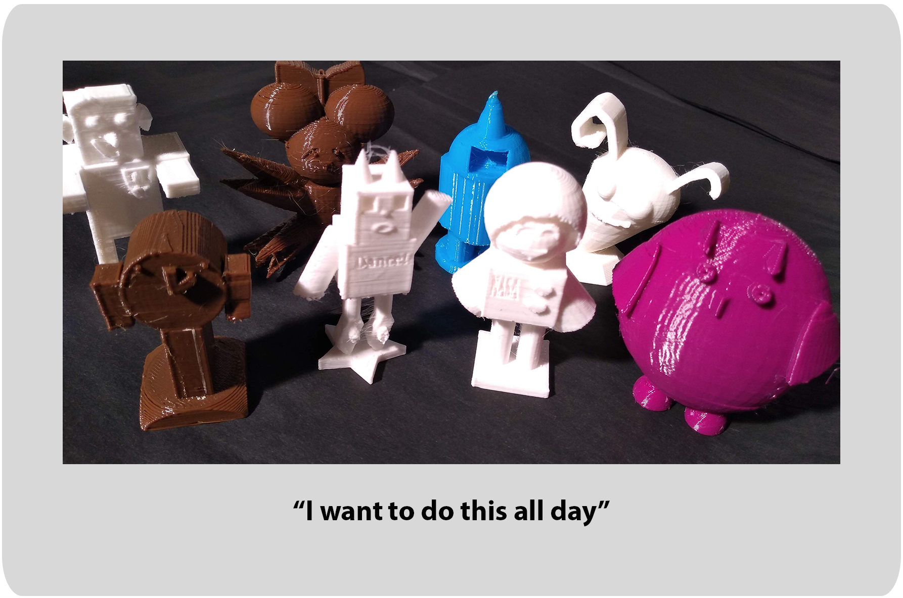

# Engineering Your Story

## What is Engineering Your Story?
"Engineering Your Story" is a two, three or six-session programme for children in Year 4 and up to learn about 3D and computer-aided-design (CAD) technology through imagination.

Engineering Your Story wants to teach you to use technology to fuel your imagination and help you engineer the story of your future, opening you up to careers in character creation, engineering, animation, design, computing and story telling.

You’ll start with paper, clay and 3D pens to experiment with shapes and dimensions. Then you’ll use 3D software Tinker CAD to create a character that will be 3D printed for you to take home.

## What the Teachers Say
"I was so impressed with how Engineering Your Story taught our children, of all different abilities, and gave them confidence with technology they’d never used before. I especially appreciated how the experience was rooted in creativity and characterisation."

-- Christabel Bunce, Deputy Head at Elmhurst School

"We cannot recommend Engineering Your Story enough! The programme completely energised and inspired the children in our school. They left each session buzzing! One child even said, “I want to do this all day.” The 3D prints that the children created and got to take home were fantastic and the course totally surpassed our expectations. The teachers were helpful, knowledgeable and passionate about the subject."

-- Ed Tang, Deputy Head Teacher, Great Missenden C of E School

"Engineering Your Story delivered a wonderful experience for our SEN children with moderate or complex learning needs. This course was exactly the kind of practical, future-career experiences that Willoughby Academy are determined to offer, and we couldn't believe how well the children were able to work with the 3D software and how much they enjoyed it."

-- Evelyn Cox, Pastoral Manager, Willoughby Academy

## What the Children Make

[See more in our Story So Far gallery](story_so_far)

## Engineering Education Grant Scheme
Engineering Your Story is possible only because of the generous Engineering Education Grant Scheme from the Institution of Engineering and Technology (theiet.org) and Institution of Mechanical Engineers (imeche.org).

The IET is celebrating 150 years in 2020 and is looking to celebrate and inspire difference makers. I hope Engineering Your Story encourages its participants to go on to make a difference.

## Contact us
Contact us on engineeringyourstory@gmail.com.

Engineering Your Story is run by [Sara O'Connor](https://github.com/saramoohead) with [Adam Hoyle](https://github.com/atomoil).

## [All course materials](session_list)
