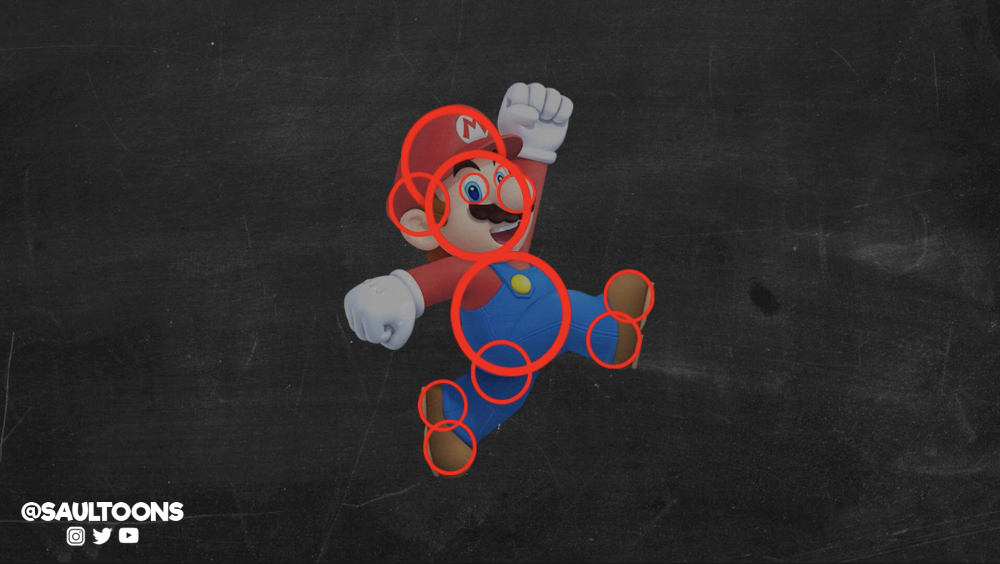

# Welcome

We are going to start off with a big question.

## Link: [Who gets to be an engineer?](001a_who_gets_to_be_an_engineer)

## Video: What is engineering? from Crash Course


Edited from source: [https://www.youtube.com/watch?v=btGYcizV0iI](https://www.youtube.com/watch?v=btGYcizV0iI)

But, you may think, maths! Maths is hard. I'm not good at maths. What do I need maths for?

- Did you know that sports needs maths? Perfecting the force to hit the ball uses maths.
- Being a firefighter or a doctor needs maths. Fight fires and save lives with formulas.
- Being an actor or a YouTuber needs maths to managing the perfect lighting, the perfect sound (and to manage all the money you'll make if you got famous!),
- and, indeed, art needs maths. Drawing needs maths.

We're going to look at some of the maths that drawing needs in relations to your characters right now.

Have you made a scary character? A hero character? A gentle and kind character? Well, the way a character looks uses maths.

## Character design uses geometry

Art uses a lot of different types of maths.  The first maths element that we are going to explore is shapes and shape theory. Shape theory is the idea that your character's shape has a huge part to play in how people will perceive it.

Source: [https://www.youtube.com/watch?v=6gDzO9fZS0o](https://www.youtube.com/watch?v=6gDzO9fZS0o)

I'd like you to experiment with the shapes of your characters. Using the spare paper, see if you can exaggerate some of the shapes of your character.

* 5 minutes for drawing

Now, to sculpt them!

* 15 minutes for sculpting

# [Onwards](001c_3d_pens.md)
