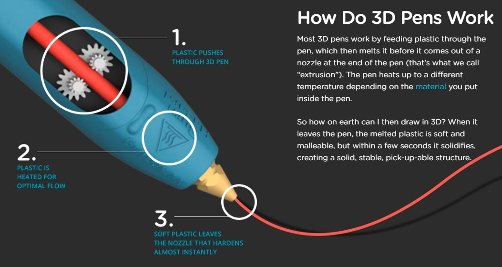
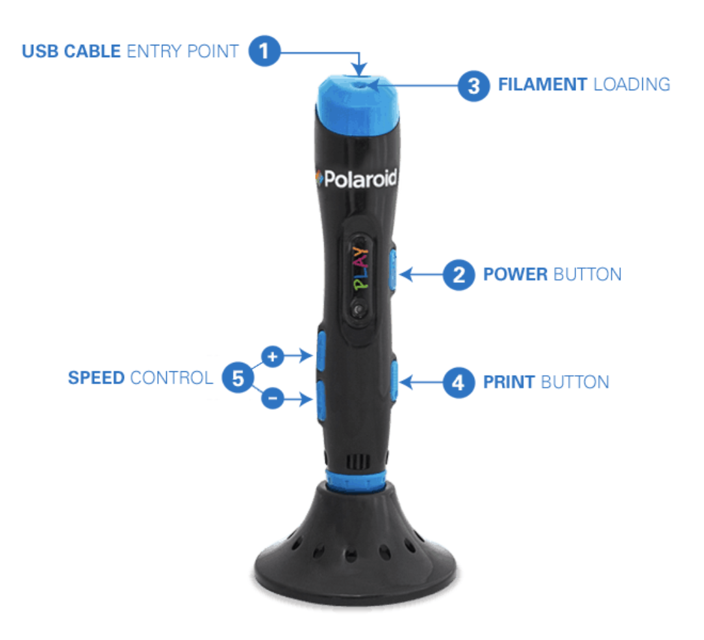

# 3d pens

You are going to learn to draw with a 3D pen.

## How it works

An engineer wants to know how things work.

Source: [https://3dpenhub.com/3d-pens-how-do-they-work/](https://3dpenhub.com/3d-pens-how-do-they-work/)

Drawing with a 3d pen is not easy, and it will take practice. Whenever you are trying to learn, please be patient with it and with yourselves.

### WARNING

**Never** touch the nozzle or the plastic near the nozzle. **It is hot and could burn you.**

This is a Polaroid Play 3d pen.

* On button, also off
* Extrude button, also retract
* Plastic goes in the top and comes out of the nozzle when it melts.
* It takes a few seconds to solidify, but then it is strong.
* It is magical engineering!

## Let's get started

The gears that push the plastic through the pen use a motor that needs electricity to turn. So, now is the time to plug it in to your computer, via the usb cord. Everybody got theirs plugged in?

We need to load in the PLA filament, and to do that the pen needs to be turned on and warmed up. When the light is red, it's heating up. When it's blue, it's ready to go.

Make sure you've got a sharp end of your filament, make sure it's not been previously melted. If it has a melted end, get a grown up to cut the end with a pair of scissors.

* Practice the squiggling! [Stencil from 3D Doodler](https://learn.the3doodler.com/stencils/lettering-practice/)

Now that you've had some practice, try doing the first letter of your name, or even your whole name. Tip: do the outline of the letter first, then fill in using "lawnmower lines".

# End of session 1

[Session list](../session_list)
