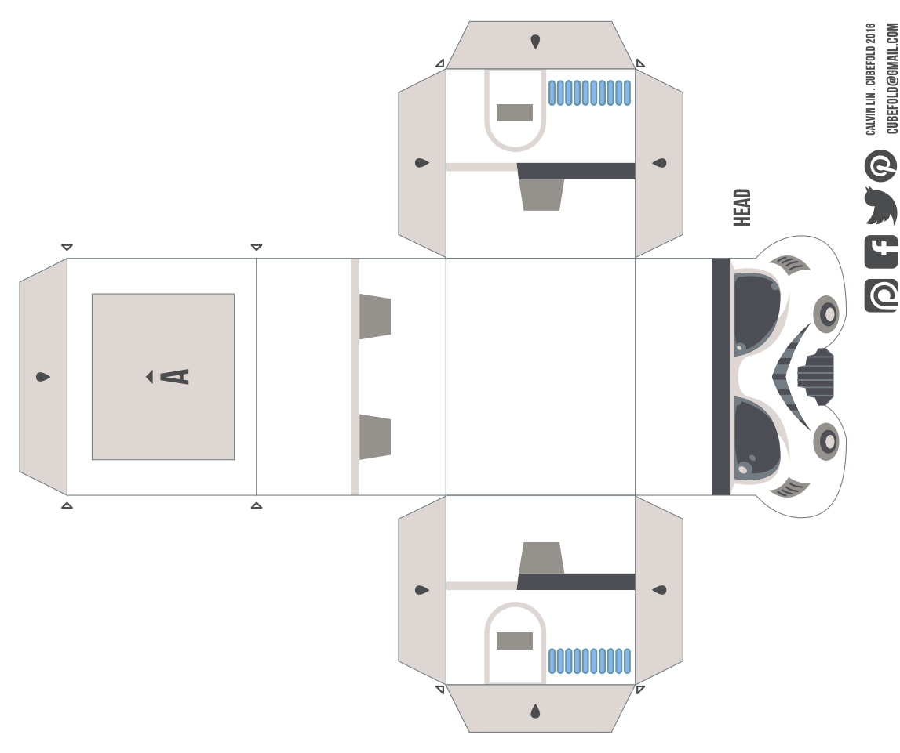
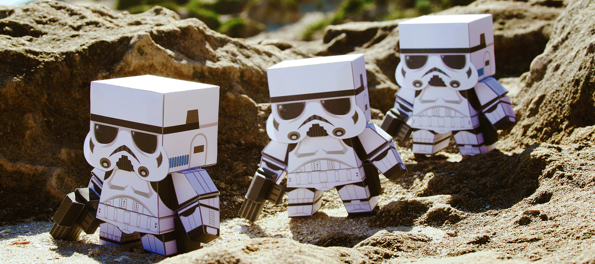
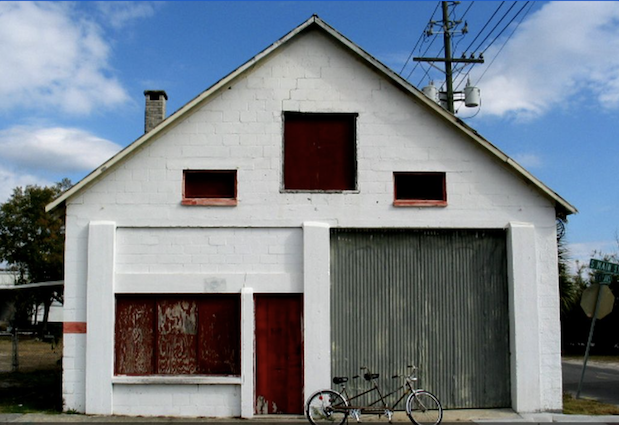
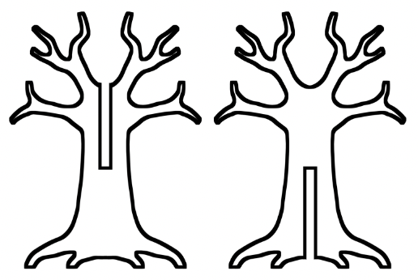

# 2D and 3D

Sometimes, if you look closely, you can see that a three-dimensional thing is made up of two-dimension things at different angles.

## Cube nets

Make them yourself here: [http://www.cubefold-craft.com/star-wars-series](http://www.cubefold-craft.com/star-wars-series)

## 2D shapes in real life

https://en.wikipedia.org/wiki/Suspension_bridge

## Making 2D shapes into 3D
* Use your 3D pen to make these two 2D shapes into a 3D tree (20 minutes)

# [Onwards](001a_tinkercad_introduction.md)
