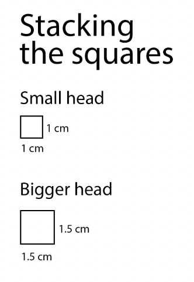
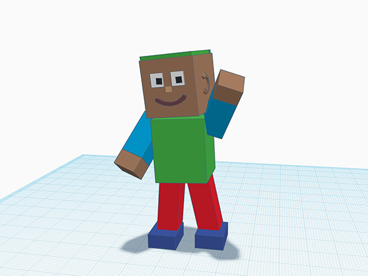
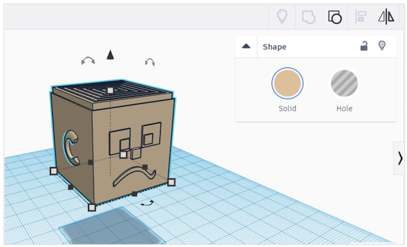

# Session 3: 3D pens drawing 3D

## How a 3D printer works



Let's remember the four types of manufacturing. What were they?

## Turn yourself into a 3D printer

* Stacking squares template (25 minutes)

We are going to become an one-person additive manufacturer by using the 3D pen like a 3D printer, and adding layers on top of each other to create something from nothing.

This template gives you a precisely measured (see, more maths!) square that you will layer up and then 3D pen eyes and a mouth onto to make a cuboid head.

# Down to the Details

## Tinkercad Avatar

In the last session with Tinkercad, you learned to move big shapes around in Tinkercad, and now it's time to get down to the details.

You're going to make an avatar in Tinkercad, like an expanded version of the 3D head you created with your 3D pen.

An avatar is a digital representation of a person or character, and for this challenge, you can think about yourself as a character. And, this might be the character that you get 3D printed, so take your time and make it excellent.

What kind of expression do you want? What kind and colour of hair would you like? Experiment with your eyes. You'll need to use solid cubes and hole cubes to create your avatar, and you should focus on the features of a face.

Your head should be 20mm x 20 mm x 20 mm.

You're going to use almost entirely boxes, in different shapes and at different angles to make your avatar. You can use a few curved shapes for things like ears or the mouth.

Once you're happy with your face, think about you as a character in a pose. Straight up and down arms and legs is never how a character stands. Put yourself into a pose that reflects you or something you like to do and your avatar will look a lot more interesting. Do this by positioning the arms, legs and head at an angle.

https://www.tinkercad.com/lessonplans/create-your-own-avatar

For next time, bring in a drawing of a character that you are going to try to model. This can be an animal or a person. But it has to be something original, from your brain.
