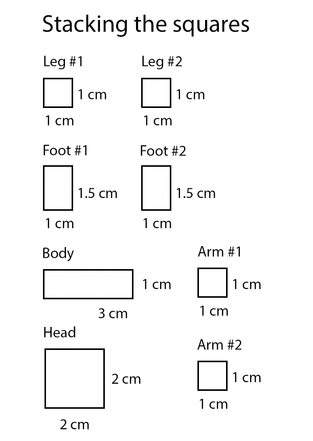

# 3D pens drawing 3D

## How a 3D printer works



Let's remember the four types of manufacturing. What were they?

## Turn yourself into a 3D printer

* Stacking squares template (25 minutes)

We are going to become an one-person additive manufacturer by using the 3D pen like a 3D printer, and adding layers on top of each other to create something from nothing.

This template gives you precisely measured (see, more maths!) squares that you will layer up and then stick together to make a humanoid figure.

Use your imagination to visualise how tall each part of the figure should be, and count the layers as you apply them, so you can replicate it again on the matching limb.

# Down to the Details

## Tinkercad Avatar

In the last session, you learned to move big shapes around in Tinkercad, and now it's time to get down to the details.

You're going to make an avatar in Tinkercad, basically a digital version of the 3D figure you've just created with your 3D pen.

An avatar is a digital representation of a person or character, and your focus is going to be on the face.

For this challenge, think about yourself as a character. What kind of expression do you want? What kind and colour of hair would you like? Experiment with your eyes. You'll need to use solid cubes and hole cubes to create the face.

You're going to use almost entirely boxes, in different shapes and at different angles to make your avatar. You can use a few curved shapes for things like ears or the mouth.

Once you're happy with your face, it's time to think about you as a character in a pose. Straight up and down arms and legs is never how a character stands. Put yourself into a pose that reflects you or something you like to do and your avatar will look a lot more interesting. Do this by positioning the arms, legs and head at an angle.

https://www.tinkercad.com/lessonplans/create-your-own-avatar
