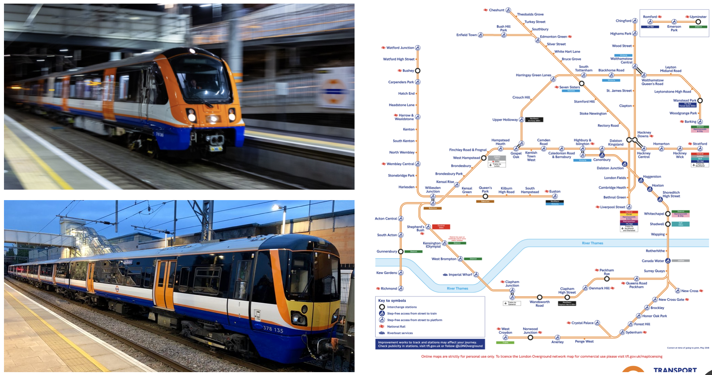

# Session 6: Blender and Presentations

## Introduction to Blender

What is Blender?

Blender is like Tinkercad, but more detailed. Plus, it has a 4th dimension. Can anyone guess what the 4th dimension is?


Blender showreel: [https://www.youtube.com/watch?v=R7TLwKwixZA](https://www.youtube.com/watch?v=R7TLwKwixZA)

Vocabulary: **Open source**

**Open source** means the code is made public for free for anyone to use is any way. People who write open source code are literally writing code to make the world better. Sharing what they make and giving their time for free, so that other people can learn, can code faster and can benefit forever. It's pretty magic.

## Play with Blender at home

If you want to challenge yourself further, try out this excellent robot video series by Shapeways. Note that the interface is an older version, but the steps are all the same.

* Intro to Blender, including how to download: https://www.youtube.com/watch?v=iWWgMWpXfnE
* Building the model: https://www.youtube.com/watch?v=t96wAzuD91I
* Preparing it for 3D printing: https://www.youtube.com/watch?v=2UOvG0b17XU

## More Tinkercad challenges

Tinkercad is also free software. (But technically, not open source.) You can create your own account and Tinkercad on any computer with internet access. Here are a few challenges you could try:

* Create your bedroom in Tinkercad. Measure your furniture and walls, and make a scale model
* Create your whole school in Tinkercad. Instead of measuring, estimate the distances between the buildings and the size of the playground in proportion to the other buildings
* Create a board game on paper and then use TInkercad to create the pieces

## Real life engineer presentation

Video on YouTube: [https://www.youtube.com/watch?v=SIpweLq_Rso](https://www.youtube.com/watch?v=SIpweLq_Rso)

Tony Bobbin MA BEng CEng FIMechE, Head of Engineering - Arriva Rail London

## Your presentations

Congratulations! You are an additive manufacturer. You have made something from nothing, from out of your own head.

## Free time, with pens or Tinkercad until home time
