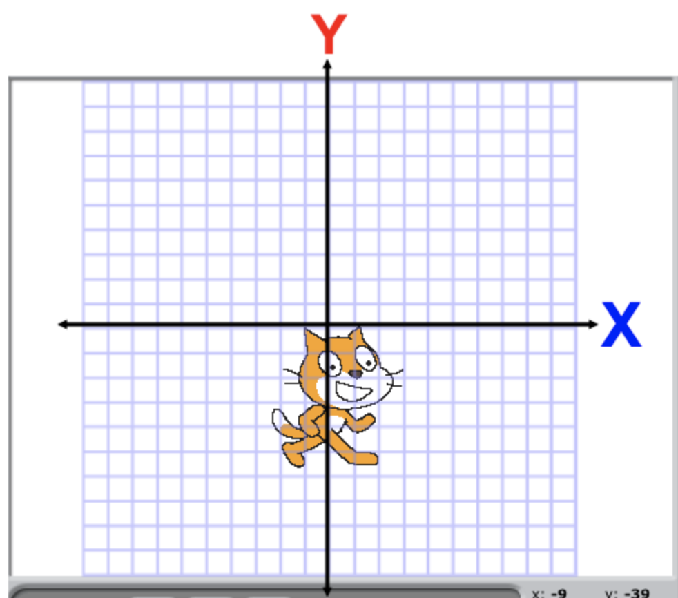
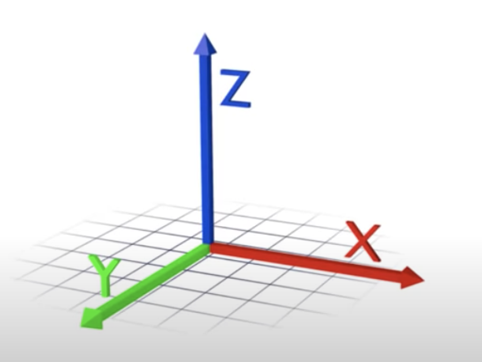
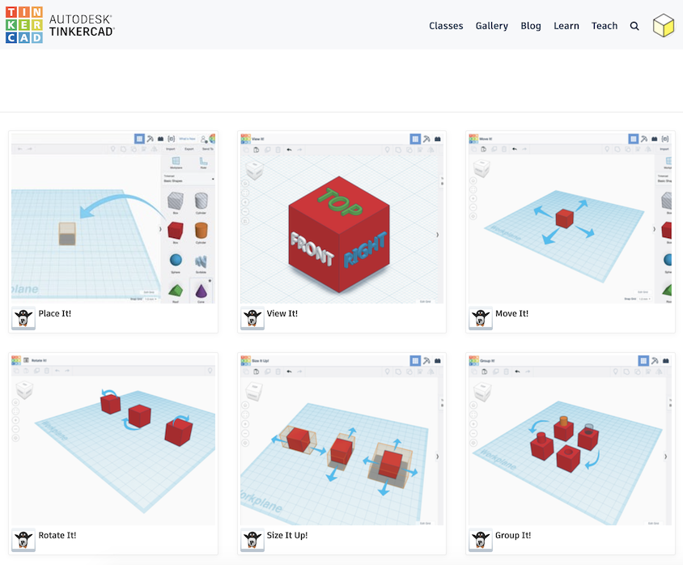

# Tinkercad introduction

## Tinkercad tutorial

Next, are going to work through the first steps of using Tinkercad together.

But before we get started, I'm going to tell you the most important thing I want you to learn on this course.

Learning is difficult.

It's hard! So, you must be kind to yourself. Take things slowly, and keep trying.

## What do we mean by three dimensional?

### 2D grid (X is short, Y has the long tail)

### 3D grid

## From 2D to 3D

The idea behind 3D printing and 3D modelling, is that you can break down a complex 3D object into 2D shapes. You can make 3D from 2D.

Look at your name boards. You were transforming 2D into 3D from the first minute you were in this room!

### 3D by design

But with a computer and 3D software, we don't have to have flat paper that we fold. We can grab 3D shapes, zoom all around them, and manipulate them into art, into characters from our imaginations.

Let's learn!

[https://www.tinkercad.com/learn/project-gallery;collectionId=OPC41AJJKIKDWDV](https://www.tinkercad.com/learn/project-gallery;collectionId=OPC41AJJKIKDWDV)

* 25 minutes

[Session list](../session_list)
