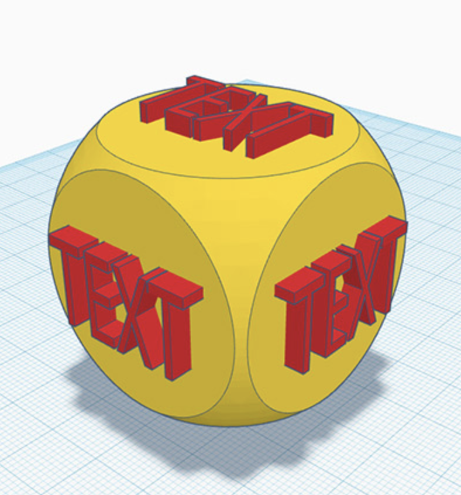

# Session 2: 3D planes

In this session, we're going to learn some more advanced 3D software techniques.

To help you think about how, let's learn how a 3D printer works.

## How a 3D printer works



Let's remember the four types of manufacturing. What were they?

## Make a die with your own words

One word per face, grouping together so that the word in an indent, like the dots on a dice. And, as we keep saying, bigger and bolder will have more impact. Lots of tiny words would be hard to read on a small dice, so try to pick one word or one shape to make sure it's clear.

You'll use placing, resizing, text bars, holes, grouping and a new technique using the workplane.

[Session list](../session_list)
