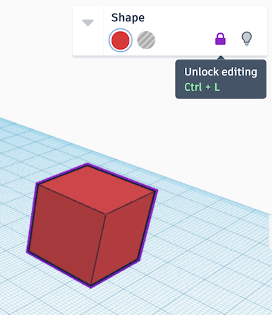
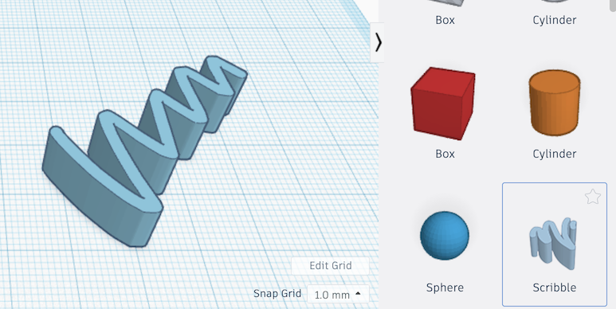

# Session 2: 3D planes

In this session, we're going to learn some more advanced 3D software techniques and we're going to learn more about how a 3D printer works.

## How a 3D printer works



Recall: What is the name of the type of manufacturing that we are going to use with our 3D prints?

## What we're doing

As you know, for our 3D print, you are each going to make a cube head, which could end up looking like this:

Remember our shape theory? You could try circle or square eyes, triangle noses or combinations. Smiles or frowns or teeth! It's up to you what kind of character you want to create, and what kind of story you might imagine them in.

Now, there are three more tools I want to show you that will come in handy when making your cube face.

### The locking tool

### The scribble tool

### The duplication tool

## Getting started with our cube heads

Your cube head should be 20mm x 20 mm x 20 mm. And we're all going to start there, and lock it into place.

Let's go!

[Session list](../session_list)
